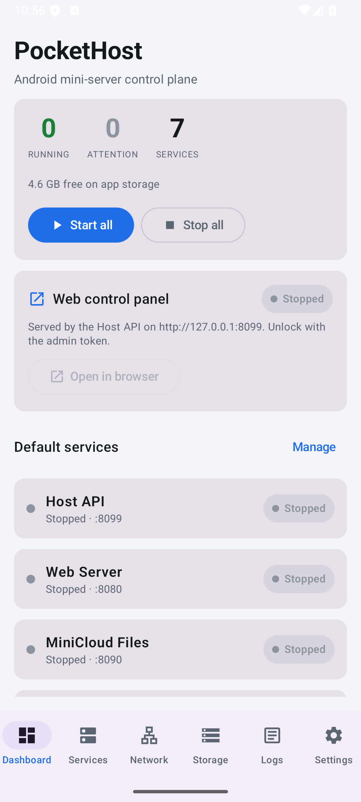
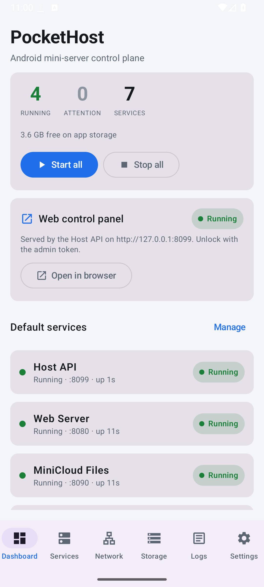
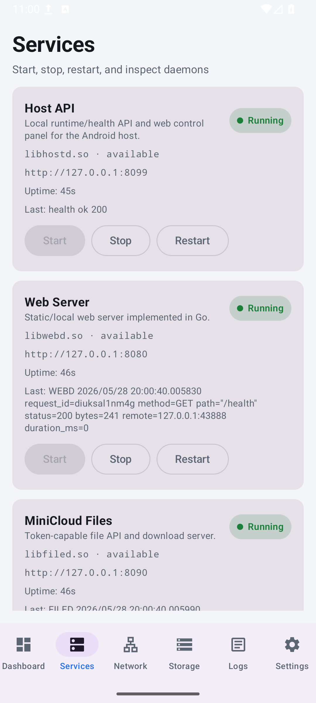
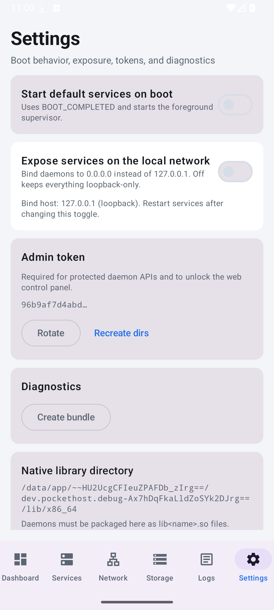
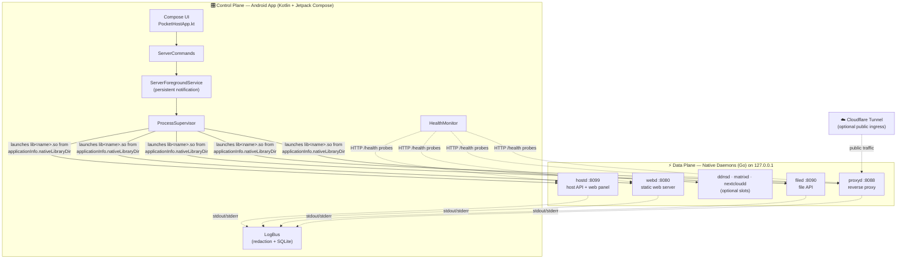
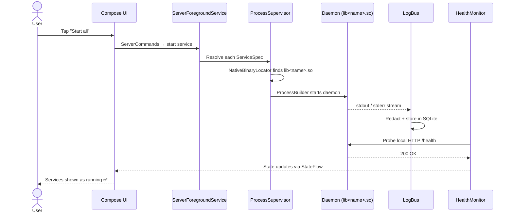
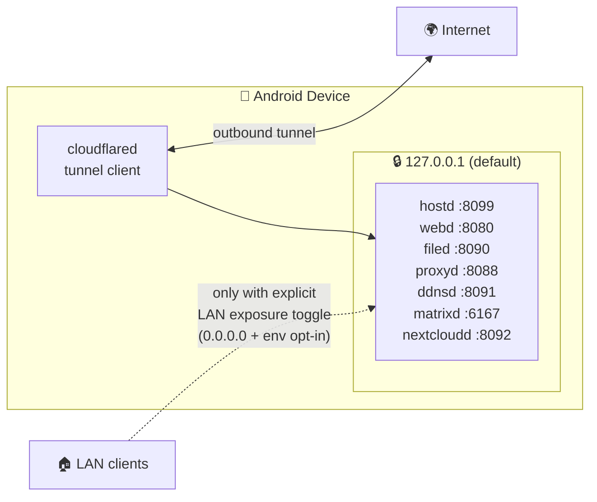
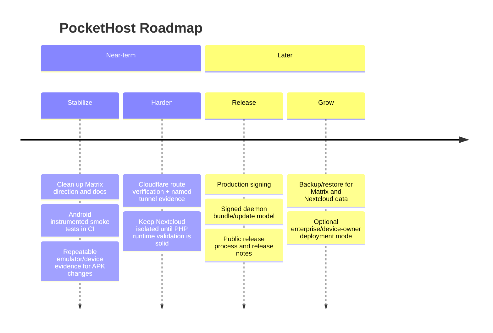

<div align="center">

# 📱 PocketHost

**Turn a spare Android phone or tablet into a small, supervised personal server.**

[](LICENSE)
[](#-getting-started)
[](go/)
[](android/)
[](#-current-status)

*The Android app is the control panel. Native daemons do the actual serving work.*

</div>

<p align="center">
  
  
  
  
</p>

---

## 📖 Table of Contents

- [Why PocketHost?](#-why-pockethost)
- [Who Is It For?](#-who-is-it-for)
- [What It Does](#-what-it-does)
- [Current Status](#-current-status)
- [How It Works](#-how-it-works)
  - [Architecture](#architecture)
  - [Services & Ports](#services--ports)
  - [Runtime Flow](#runtime-flow)
  - [Network & Security Model](#network--security-model)
- [Getting Started](#-getting-started)
- [Repository Layout](#-repository-layout)
- [Documentation](#-documentation)
- [Roadmap](#-roadmap)
- [Contributing](#-contributing)
- [License](#-license)

---

## 💡 Why PocketHost?

Most people have a perfectly good computer sitting in a drawer: an old phone
with a working CPU, Wi-Fi, and flash storage. PocketHost puts it back to work.

- **Spare hardware, real server.** A phone on a charger, an old tablet on a
  shelf, or an emulator used as a lab box becomes a self-hosted file server,
  web host, and (eventually) Matrix / Nextcloud node.
- **Supervised, not hacked together.** Instead of a pile of Termux scripts,
  PocketHost runs a proper Android foreground service that supervises native
  daemons, monitors their health, collects redacted logs, and survives
  reboots.
- **Private by default.** Everything binds to `127.0.0.1` unless you
  explicitly opt into LAN exposure. Public access goes through Cloudflare
  Tunnel — a deliberate path, not an accidental open port.

## 👥 Who Is It For?

| You are… | PocketHost gives you… |
|---|---|
| 🧑‍💻 A self-hoster with a spare phone | A pocket-sized personal cloud: files, web hosting, tunnels |
| 🔬 A tinkerer / developer | A supervised lab box on an emulator or test device |
| 🔐 A privacy-minded user | Loopback-first defaults, token-protected APIs, redacted logs |
| 🏗️ A contributor | A clean Go + Kotlin codebase with a documented change process |

> [!IMPORTANT]
> PocketHost is currently a **developer-sideload MVP**, not a production
> release. It can build, run the core local daemons, package split APKs, and
> expose selected services through Cloudflare Tunnel — but release signing,
> public distribution, automated device CI, and full Matrix/Nextcloud
> validation are still in progress.

## ✨ What It Does

- 📊 **Android dashboard** for starting, stopping, restarting, and inspecting services
- 🛡️ **Foreground supervisor service** with a persistent notification while daemons run
- 🌐 **Local web server** for static files
- 📁 **Token-protected file API** for browse, upload, download, and delete
- 🎛️ **Host web control panel** served by `hostd`
- 🔀 **Local reverse proxy** for service routing
- 📡 **Optional DDNS updater** (Cloudflare DNS)
- ☁️ **Optional Cloudflare Tunnel** supervisor slot for public ingress
- 💬 **Optional Matrix homeserver** slot
- 🧪 **Experimental Nextcloud wrapper** slot
- 🗃️ **SQLite-backed log persistence** and diagnostics bundle export
- 🔒 **Loopback-first security defaults** with an explicit LAN exposure toggle

## 🚦 Current Status

### ✅ Works today

| Area | Status |
|---|---|
| Android app (Kotlin, Jetpack Compose, AGP) | ✅ Builds |
| Default Go daemons | ✅ Build and pass local tests |
| Local daemon verification | ✅ Passes |
| Debug APKs (`arm64-v8a`, `armeabi-v7a`, `x86`, `x86_64`, `universal`) | ✅ Build |
| Native daemon artifacts staged under `android/app/src/main/jniLibs` | ✅ Done |

### 🚧 Not public-release ready yet

| Area | Status |
|---|---|
| Release signing | 🚧 Release builds are debug-signed |
| Google Play distribution | 🚧 Not implemented |
| Android device/emulator tests in CI | 🚧 Not automated |
| Matrix direction | 🚧 Needs cleanup across docs and runtime artifacts |
| Nextcloud | 🧪 Experimental, depends on PHP runtime assets |
| Cloudflare public route verification | 🚧 Needs device evidence |
| Signed daemon bundle/update model | 🚧 Not implemented |

## ⚙️ How It Works

### Architecture

PocketHost is deliberately split into a **control plane** (the Android app)
and a **data plane** (native daemons launched as child processes).



**The control plane** (Android app) owns device-specific responsibilities:
UI and service controls, foreground service lifecycle, persistent
notification, boot receiver for optional autostart, service configuration and
preflight checks, health polling, log collection/redaction/retention, and
diagnostics bundle creation.

<details>
<summary><b>Key control-plane files</b></summary>

- [`android/app/src/main/java/dev/pockethost/ui/PocketHostApp.kt`](android/app/src/main/java/dev/pockethost/ui/PocketHostApp.kt)
- [`android/app/src/main/java/dev/pockethost/supervisor/ServerForegroundService.kt`](android/app/src/main/java/dev/pockethost/supervisor/ServerForegroundService.kt)
- [`android/app/src/main/java/dev/pockethost/supervisor/ProcessSupervisor.kt`](android/app/src/main/java/dev/pockethost/supervisor/ProcessSupervisor.kt)
- [`android/app/src/main/java/dev/pockethost/supervisor/ServiceRegistry.kt`](android/app/src/main/java/dev/pockethost/supervisor/ServiceRegistry.kt)
- [`android/app/src/main/java/dev/pockethost/supervisor/ServicePreferences.kt`](android/app/src/main/java/dev/pockethost/supervisor/ServicePreferences.kt)

</details>

**The data plane** is a set of Go daemons living under [`go/cmd/*`](go/cmd),
with shared daemon safety code in [`go/internal/pocket`](go/internal/pocket).

> [!NOTE]
> **Why `.so` files?** The daemons are packaged as native library artifacts
> (`android/app/src/main/jniLibs/<abi>/lib<name>.so`) because that is the one
> path Android reliably ships executables through. The `.so` suffix is purely
> a packaging mechanism — PocketHost launches these files as **executable
> child processes** from `applicationInfo.nativeLibraryDir`, not as loaded
> libraries.

### Services & Ports

| Service | Binary | Default | Port | Purpose |
|---|---|:---:|---:|---|
| 🎛️ Host API | `libhostd.so` | ✅ on | `8099` | Host health, web panel, daemon status aggregation |
| 🌐 Web Server | `libwebd.so` | ✅ on | `8080` | Static/local web hosting |
| 📁 MiniCloud Files | `libfiled.so` | ✅ on | `8090` | Token-protected file API |
| 🔀 Local Reverse Proxy | `libproxyd.so` | ✅ on | `8088` | Host-based local reverse proxy |
| 📡 DDNS Updater | `libddnsd.so` | ⬜ off | `8091` | Optional Cloudflare DNS updater |
| 💬 Matrix Server | `libmatrixd.so` | ⬜ off | `6167` | Matrix homeserver slot |
| 🧪 Nextcloud Experimental | `libnextcloudd.so` | ⬜ off | `8092` | Experimental PHP/Nextcloud wrapper |
| ☁️ Cloudflare Tunnel | `libcloudflared.so` | ⬜ off | n/a | Optional public tunnel client |

### Runtime Flow

What happens when you tap **Start all**:



### Network & Security Model



Services bind to **loopback by default**. The Settings screen has an explicit
LAN exposure toggle: when enabled, the app passes `0.0.0.0:<port>` and sets
`POCKETHOST_ALLOW_PUBLIC_BIND=true`. Without that environment variable, the
Go daemons **refuse** non-loopback bind addresses. Public internet access
should go through Cloudflare Tunnel or another deliberate tunnel path — never
accidental raw port exposure.

<details>
<summary><b>🔐 Full list of security defaults</b></summary>

- Services bind to `127.0.0.1` by default.
- LAN binding is opt-in and visibly warned in the UI.
- Daemons reject public bind addresses unless explicitly allowed.
- Admin APIs support `X-PocketHost-Token` and `Authorization: Bearer`.
- Token comparison uses a constant-time helper.
- `/health` stays unauthenticated for local supervision.
- File and web paths reject traversal and symlink escape.
- Directory listing is disabled by default.
- Uploads have a configurable byte cap and atomic commit behavior.
- Cloudflare credentials are not committed and are copied into app-private
  storage when imported.
- Logs are redacted before UI and SQLite storage.
- SQLite log retention is bounded.

See [`docs/THREAT_MODEL.md`](docs/THREAT_MODEL.md) for the full analysis.

</details>

## 🚀 Getting Started

### Prerequisites

| Tool | Version |
|---|---|
| JDK | 17+ |
| Android SDK platform | 36 |
| Android build tools | 36.0.0 |
| Android NDK | 27+ |
| Go | 1.23+ |
| Gradle | wrapper from `android/gradlew` |

> Kotlin is resolved by the Android Gradle plugin; standalone `kotlinc` is
> useful but not required for the Android build.

```bash
export ANDROID_SDK_ROOT=$HOME/Android/Sdk
export ANDROID_HOME=$ANDROID_SDK_ROOT
export ANDROID_NDK_ROOT=$ANDROID_SDK_ROOT/ndk/27.2.12479018
```

### Build & Test

```bash
# 1️⃣ Run the local repository baseline
#    (Go unit tests, formatting check, live daemon verification,
#     shell syntax checks, basic repository file checks)
./scripts/ci-local.sh

# 2️⃣ Run Go tests directly
cd go && go test ./... && cd ..

# 3️⃣ Cross-compile the Go daemons for Android
./scripts/build-go-android.sh all

# 4️⃣ Build the Android debug APKs
cd android && ./gradlew :app:assembleDebug && cd ..

# 5️⃣ Stage local split APK artifacts
./scripts/package-android.sh release
```

> [!WARNING]
> The current `release` build type is **debug-signed** and is for sideload
> testing only.

### First Device Smoke Test

1. 📲 Install the debug APK on an **Android 10+** device.
2. 🔔 Grant notification permission.
3. ▶️ Tap **Start all**.
4. 👀 Confirm the persistent PocketHost notification appears and default
   services show as running.
5. 🩺 Probe the health endpoints:

   ```bash
   adb shell 'toybox wget -qO- http://127.0.0.1:8099/health || true'
   adb shell 'toybox wget -qO- http://127.0.0.1:8080/health || true'
   adb shell 'toybox wget -qO- http://127.0.0.1:8090/health || true'
   adb shell 'toybox wget -qO- http://127.0.0.1:8088/health || true'
   ```

6. 📜 Open **Logs** and confirm daemon output appears.
7. ⏹️ Tap **Stop all** and confirm services stop.

See [`docs/runbooks/VERIFY_ANDROID_DEVICE.md`](docs/runbooks/VERIFY_ANDROID_DEVICE.md)
for the fuller checklist.

## 🗂️ Repository Layout

```text
PocketHost/
├── android/           📱 Android app, Compose UI, foreground supervisor
├── go/                ⚡ Go daemon source and tests
├── rust/matrixd/      💬 Matrix placeholder adapter source
├── configs/examples/  📋 Safe sample configs without secrets
├── docs/              📚 Architecture, product, threat model, runbooks
├── releases/          📦 Local APK staging area
├── scripts/           🔧 Build, package, and verification scripts
├── AGENTS.md          🤖 Agent/developer rules for this repo
├── FLYWHEEL.md        🔄 Change and evidence process
├── SOUL.md            ✨ Product and engineering taste notes
├── LICENSE            ⚖️ Apache-2.0
└── NOTICE             📄 Third-party integration notes
```

## 📚 Documentation

| Document | What's inside |
|---|---|
| [`docs/ARCHITECTURE.md`](docs/ARCHITECTURE.md) | System design deep dive |
| [`docs/DATA_FLOW.md`](docs/DATA_FLOW.md) | How data moves through the system |
| [`docs/PRODUCT_SPEC.md`](docs/PRODUCT_SPEC.md) | Product specification |
| [`docs/THREAT_MODEL.md`](docs/THREAT_MODEL.md) | Security threat model |
| [`docs/BUILDING.md`](docs/BUILDING.md) | Detailed build instructions |
| [`docs/CLOUDFLARED.md`](docs/CLOUDFLARED.md) | Cloudflare Tunnel setup |
| [`docs/MATRIX.md`](docs/MATRIX.md) | Matrix homeserver notes |
| [`docs/NEXTCLOUD_EXPERIMENTAL.md`](docs/NEXTCLOUD_EXPERIMENTAL.md) | Experimental Nextcloud wrapper |
| [`docs/PROJECT_STATUS.md`](docs/PROJECT_STATUS.md) | Current project status |
| [`docs/ROADMAP.md`](docs/ROADMAP.md) | Full roadmap |
| [`docs/runbooks/`](docs/runbooks/) | Step-by-step verification runbooks |

## 🗺️ Roadmap



## 🤝 Contributing

For ordinary code changes, the **definition of done** is:

- ✅ `./scripts/ci-local.sh` passes.
- 🔒 No secrets are added to code, docs, configs, screenshots, logs, or fixtures.
- 🌐 Network behavior remains loopback-first unless a human-approved change
  says otherwise.
- 🧯 Service failures show useful states instead of crashing the app.
- 📝 Docs are updated when behavior, commands, ports, or release status changes.

<details>
<summary><b>Additional evidence for Android behavior changes</b></summary>

- APK build result.
- Install evidence on an emulator or physical device.
- Foreground notification evidence.
- At least one daemon started from the app.
- Successful local `/health` probe.
- Logs visible in the app.

</details>

For tunnel, Matrix, Nextcloud, release, or data-migration changes, follow the
gates in [`AGENTS.md`](AGENTS.md) and [`FLYWHEEL.md`](FLYWHEEL.md).

## ⚖️ License

PocketHost code and docs are licensed under **Apache-2.0**. See
[`LICENSE`](LICENSE), [`NOTICE`](NOTICE), and
[`docs/LICENSE_DECISION.md`](docs/LICENSE_DECISION.md).
